# 忍者アクションゲーム - Ninja Game Showcase

 <!-- ゲームのサムネイル画像をここに -->
 
 

## 目次

- [コンセプト](#コンセプト)
- [使用ツール・開発環境](#使用ツール開発環境)
- [学習実績サマリー](#学習実績サマリー)
- [学習構成と主な習得スキル](#学習構成と主な習得スキル)
- [ゲームの特徴見どころ](#ゲームの特徴見どころ)
- [スクリーンショット動画](#スクリーンショット動画)
- [ファイル構成（オプション）](#ファイル構成オプション)
- [補足参考資料](#補足参考資料)

 
 

## コンセプト

このプロジェクトは、Unreal Engine 5 初学者向けの教材書籍  
『Unreal Engine 5で極めるゲーム開発』を参考に制作した学習作品です。

ゲーム開発の実務に必要な基礎知識を、書籍を通じて段階的に習得し、  
その成果を形にしたポートフォリオとして本リポジトリを構成しています。

ハンズオン形式で設計・実装・演出・AI構築・UI配置などを網羅しており、  
実際にUnreal Engine 5を使って「一通り作れる」ことを示すサンプルにもなっています。
 
 

## 使用ツール・開発環境

- Unreal Engine 5.1
- Blueprint（ブループリント）
- Niagara
- アニメーションBP
- マテリアルエディタ
- Windows 11
- Visual Studio（補助用）
 

## 学習実績サマリー

- Unreal Engine 5 を用いた 3Dアクションゲーム開発のプロセスを、プロトタイピングから演出構成まで一貫して実践
- ゲームシステム設計・敵AI・デバッグ・素材最適化など、全57章構成のハンズオン教材を完全に習得
- 設計視点・再利用性・デバッグ効率を意識した開発スタイルを通じて、UE5の機能を体系的に学習
 

## 学習構成と主な習得スキル
| フェーズ | 学習内容 | スキル例 |
|---------|---------|---------|
| ①基礎構築(〜31章)  | プロジェクト作成 アクタ制御 コリジョン設定 UI・イベント処理の基礎 | キャラクター移動・攻撃 アニメ制御（タイムライン／シーケンサー） イベントディスパッチャ UI設計  |
| ②応用設計(32〜39章)  | 構造体・配列・BP通信 敵AI制御 物理アクション BPモジュール設計 | デリゲート設計 敵行動AI 物理コンストレイント 再利用可能なコンポーネント設計 |
| ③完成・演出（40〜57章） | コンポーネント再利用 AI拡張 演出設計 素材最適化 | コンポーネント化 敵AIパターン拡張 物理マテリアル カメラ演出 マテリアル＆テクスチャ制御 メッシュ編集 ポストプロセス Niagara入門 |

実装を通じて、「イベント駆動型思考／再利用性を意識した設計／デバッグスキル」を強化
 
 

## 設計・ロジック構築（BP構成・イベント連携）
プレイヤーや敵キャラの基本的なアクション（移動／ジャンプ／攻撃）に加えて、  
以下のようなロジックを自作 Blueprint で構築・実装しました

### ■ ダメージ処理・死亡判定の制御（イベント AnyDamage）  
→ イベントで1回だけ動作停止処理を実行し、5秒後にキャラクターを削除

 
 

### ■ ラグドール物理処理の実装  
→ 死亡時に「Ragdoll」へ切り替え、物理挙動と上向きのインパルスで自然に倒れる演出

 
 

### ■ 攻撃ヒット時のダメージ付与（イベント Hit）
→ ヒット時に Apply Damage を呼び出し、相手に1.0のダメージを送信

 

### 工夫ポイント
- 「イベントディスパッチャ」や「イベントトリガー」を活用して、ゲーム内オブジェクトの連携制御を実装
- 関数・マクロを分割し、処理の再利用性と可読性を向上
- 「ループ処理」や「ブランチ」「遷移判定」などで進行管理を明確化
- Print String／Break Point／Watch などのデバッグ機能を活用し、逐次挙動の確認・修正を実施
 
 

## 空間設計・演出（サブレベル・フォリッジ・光）
ステージの構成要素をレイヤー構造で分けて開発効率＆演出品質を向上を目指しました

### ■ サブレベル分割とレイヤー構成
→ 背景・光源・メッシュ・ギミックなど、目的別に7つのサブレベルへ分割して管理 
→ レイヤーは15種類に分類し、さらに階層ごとに細分化することで整理性と検索性を向上
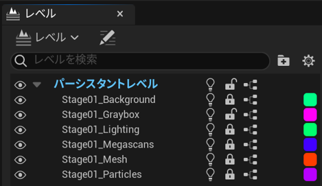
| サブレベル名 | 管理内容・役割 |
|-------|------|
| Stage01_Background | 遠景・空背景などの表示用 |
| Stage01_Graybox | グレーボックスと当たり判定を仮置きで管理 |
| Stage01_Lighting | 昼夜や雰囲気の制御の管理 |
| Stage01_Megascans | 背景の植物やジオラマ感の演出の管理 |
| Stage01_Mesh | 建物構造の管理 |
| Stage01_Particles | パーティクルなど一時的な演出の管理 |

 
■ ギミックあり・なし比較 

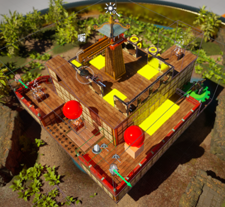　
 Graybox有効（ゲーム中の動的演出も表示）

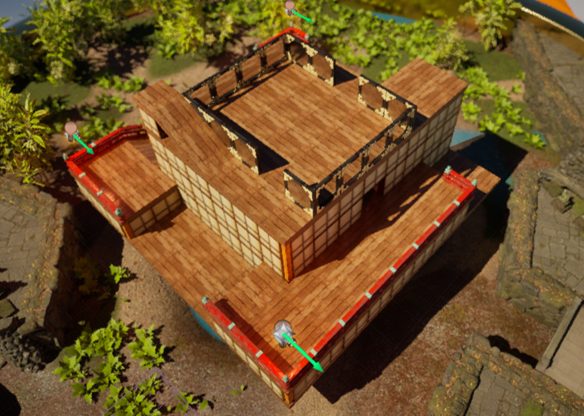　
 Graybox無効（建築のみ）
 

### ■空間演出の工夫（ライティング・演出）  
→ Directional Light & SkyLight で時間帯変化を表現  
→ ポイントライトやポストプロセスで雰囲気強化（特に被写界深度によるジオラマ感）  
→ チェックポイント到達時に昼→夜切り替え演出あり（屋根が閉じる）  
→ 背景にフォリッジ（植物）を配置し、奥行きと没入感を強調  
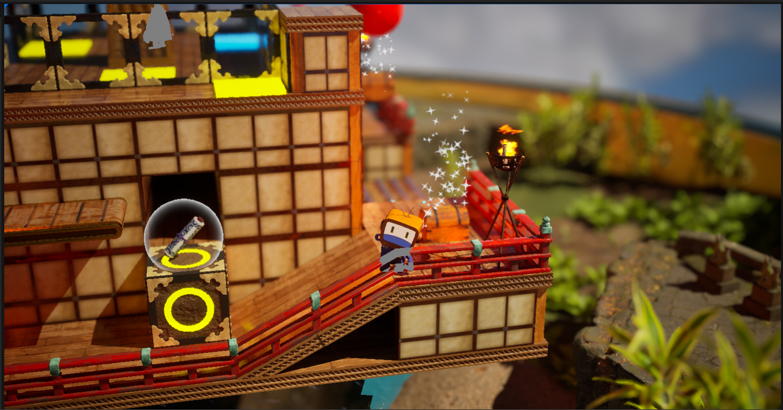　
 手前と奥をボケるようにしてミニチュア撮影感を表現(昼の雰囲気)
 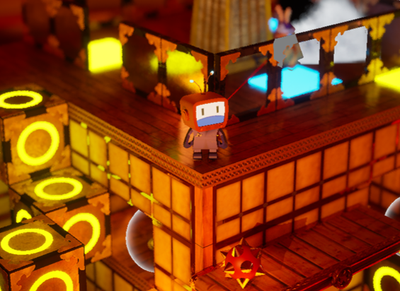　
 夜の雰囲気

### 工夫ポイント
視認性とプレイアビリティの両立を意識しつつ、ロケーションの雰囲気を高める演出を実現グレーボックスを残すことで、  
構造の視覚的理解を助ける開発後期でもレベルを整理・最適化しやすい構成
 
 

## 敵キャラのAI構築とゲーム性の実装
プレイヤーと対峙する敵キャラの行動制御やゲーム性を強化するロジックを実装しました
### ■ AI構築・行動制御のロジック
- AIコントローラーのBlueprintでBTの開始処理
 → プレイ開始時にパトロールポイントを持っているか判定し、BT_Patrolを実行
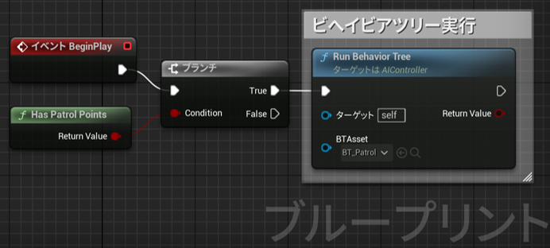　

- ビヘイビアツリー（BT_Patrol）で敵の行動を制御
 → パトロール／プレイヤー検知後のスプリント／攻撃までをノードで管理
 → 条件付き分岐（Blackboard, Cooldown, Time Limit）で状況に応じたアクションを制御
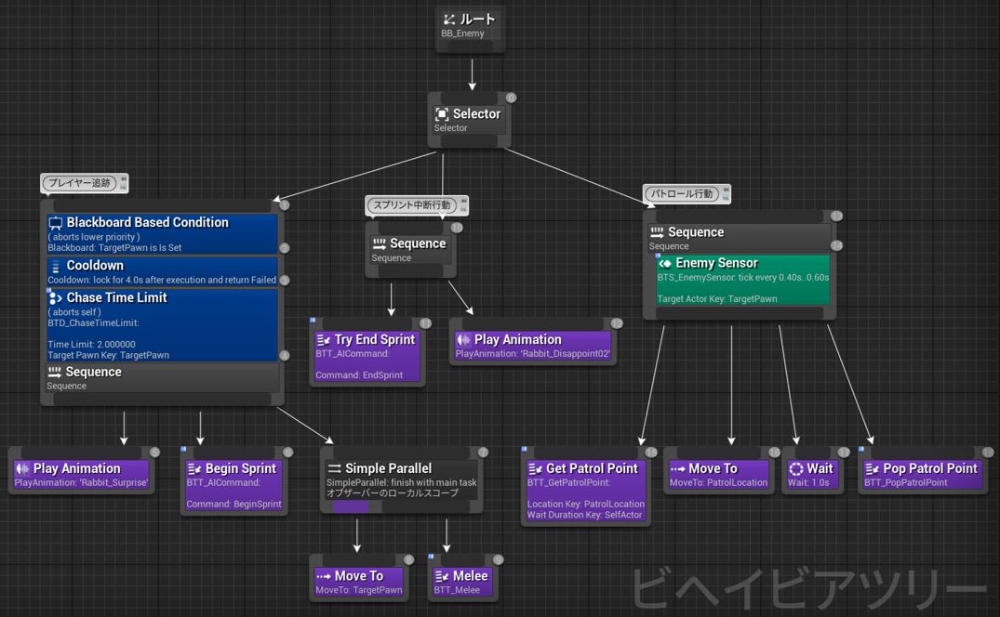　

【敵キャラの追跡ロジック】  
・Blackboard Based Condition：プレイヤーを視認したかどうかを判定（TargetPawnがセットされているか）  
・Cooldown / Time Limit：連続して追いかけすぎないように制限（ゲーム性のバランス調整）  
・Begin Sprint → MoveTo → Melee：スプリント開始→近づいて攻撃  
・End Sprint：追跡中断後にスプリント解除とアニメーション演出  

【パトロール行動】  
・Enemy Sensor：定期的にプレイヤーを検知（tick every 0.4s〜0.6s）  
・Get Patrol Point → MoveTo → Wait → Pop Patrol Point：パトロールポイントの取得〜巡回処理  
 

## 敵キャラのAI構築とゲーム性の実装
プレイヤーと対峙する敵キャラの行動制御やゲーム性を強化するロジックを実装しました

### ■ ゲーム性・演出との連携
* 敵キャラの行動ロジック
　・ プレイヤーに反応 → スプリント → 攻撃→転倒（エフェクト・アニメーション連動）
* 砲撃ギミック
　・Triggerを用いた距離感のある攻撃演出（エリア内侵入検知 → 遠距離から砲撃）
* 演出構成
　・エフェクト（砂埃やアニメーション）と連動させ、リアクションに厚みを持たせた演出を実現

gif gif

### ■ 視覚フィードバック強化
* ナイアガラ演出の実装  
→短時間かつ瞬間的な「疾走感」「衝撃感」を表現するため、Once＆Burst構成。  
　 キャラクターの後方に砂ぼこりを飛ばしつつ、自然に消える演出を構築  
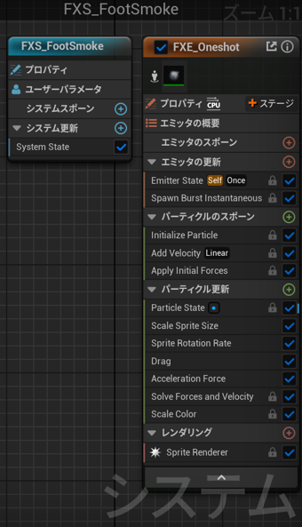　  

| セクション名 | ノード名 | 補足 |
|-------|------|------|
| エミッタの更新 | Emitter State: Self / Once |自身の状態を1回だけ確認・再生（ループしない） |
| 〃 | Spawn Burst Instantaneous | すべてのパーティクルを一括で即座に発生させる |
| パーティクルのスポーン | Add Velocity: Linear | 前方向へ勢いよく飛ぶように初速を加える |
| パーティクル更新 | Scale Sprite Size | サイズに変化をつけて迫力や奥行き感を演出 |
| 〃 | Drag | 空気抵抗で徐々に減速する効果 |
| 〃 | Acceleration Force | 加速度を加えて自然な浮遊感や跳ね感を演出 |
| レンダリング | Sprite Renderer | スプライト表示で視覚的に煙を描画 |

### 工夫ポイント
- NavMesh × Trigger × AI制御 を連携し、1つの流れでゲームが成立
- AI行動の可視化（プレイヤーを「見つける」→「走ってくる」→「攻撃する」）
- アニメーションやパーティクルを組み合わせ、ゲーム性と視覚の一体化を実現

## ゲーム紹介動画 / GIF

<!-- YouTube動画リンク例 -->

<!-- または GIF 例（GitHubにアップロードした assets/gif_example.gif を使う場合） -->
<!--  -->
 

## スクリーンショット
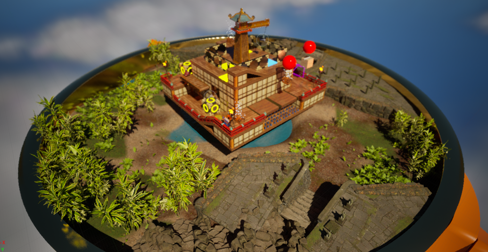  
マップ・レベル全景,(昼)  
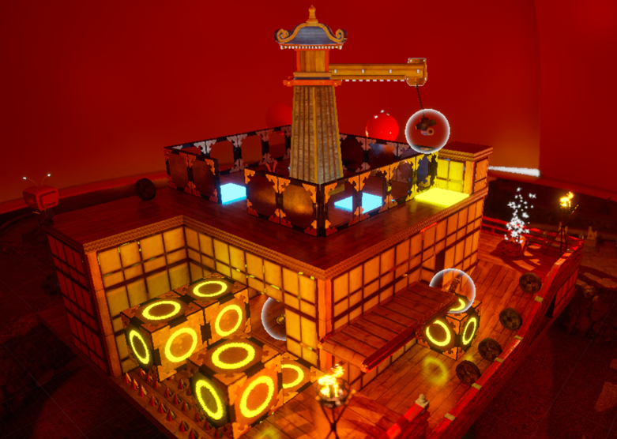  
ステージ上の巻物(白い輪のエフェクト付)を３つ集めたらゲームクリア,(夜)  
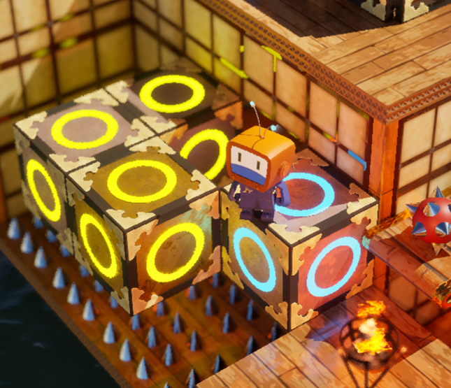  
乗ると色が変わり、ジャンプすると動くブロックのパズル地帯  
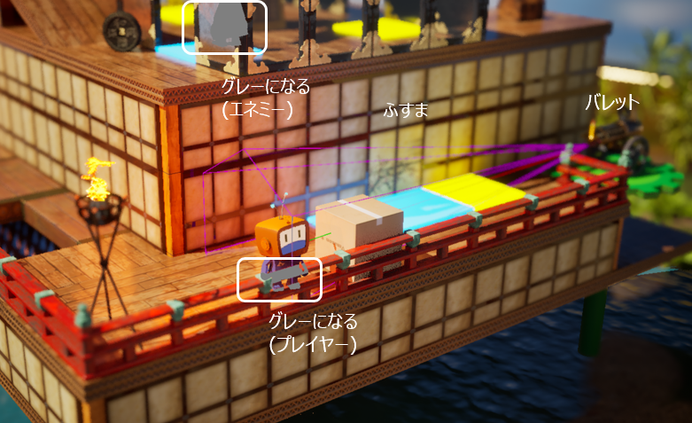  
-  バレットの射程圏内であっても、障害物があれば射撃が始まらないので段ボールを盾として押し進み、身を守るシーン
-  床スイッチをすべてブルーにしたらふすまが開くギミック
-  遮蔽物にプレイヤーやエネミーの体の一部が隠れたらその部分はグレーに見える  
   ※1Fのふすまの中は建物内が迷路になっていて、プレイヤーは直接通路が見えず、箱庭の外観からグレーに透けている  
   キャラクターが廊下を進めるかどうかを手探りで探す仕組み  

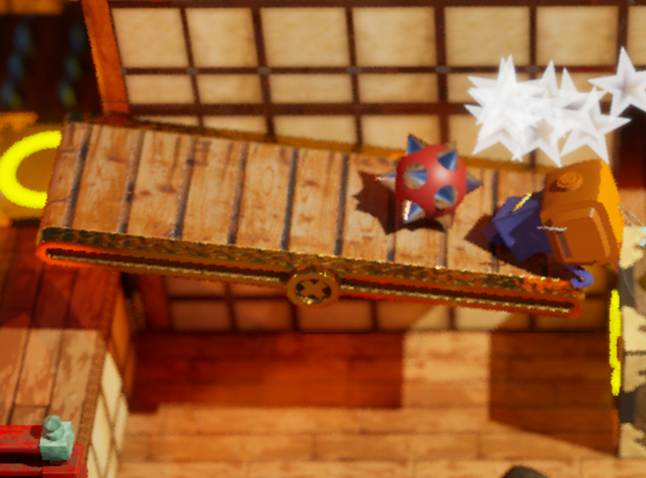  
シーソーが傾いたら棘鉄球が転がってきて、当たると死ぬシーン

 

## まとめ
本作は、Unreal Engine 5 初学者向けの書籍をもとに制作を進めたアクションゲームです。

書籍の内容はすべて実装を完了し、現在はカットシーン・UI・サウンド・パッケージ化など、
応用的な要素の制作に着手しています。

本プロジェクトを通して、
・ブループリントによるロジック構築  
・アクタのスポーン・コリジョン制御  
・レベル構成の分割と最適化  
・Niagara を用いたパーティクル演出  
・アニメーションBP・StateMachine・BlendSpace の活用  
など、ゲーム開発における基本的な知識と工程を一通り経験することができました。  

## 今後の展望
今後は書籍の枠を越え、  
・自作のギミックやUI演出の追加  
・ストーリー・演出面の強化  
・ゲームバランス調整・難易度設計  
・シーン構成やゲーム全体の「完成度」向上  
などを通じて、「ひとつの作品としての完成」を目指していきます。  
学習→実装→発展のサイクルを回しつつ、オリジナル作品にも挑戦していく予定です。  

現在は C++ による実装にも挑戦を開始しており、Unreal Engine の内部挙動やパフォーマンス最適化の理解を深めながら、  
より柔軟で高度なゲーム制作に取り組んでいます。
  

---

### 📖 参考文献・制作ガイド
本プロジェクトは、書籍『Unreal Engine 5で極めるゲーム開発』（湊 和久 著）をベースに制作したポートフォリオ用ゲームです。  
使用したアセット・内容は個人学習目的に準拠し、著作権を侵害しない形で構成しています。

