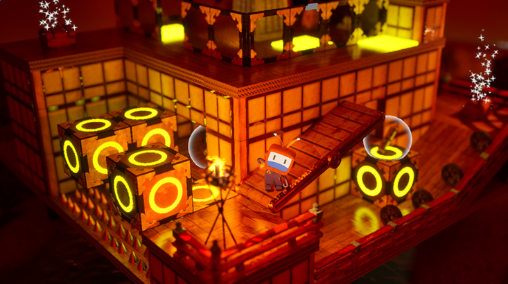

# 忍者アクションゲーム - Ninja Game Showcase

 <!-- ゲームのサムネイル画像をここに -->
 
 

## 目次

- [コンセプト](#コンセプト)
- [使用ツール・開発環境](#使用ツール開発環境)
- [学習実績サマリー](#学習実績サマリー)
- [学習構成と主な習得スキル](#学習構成と主な習得スキル)
- [ゲームの特徴見どころ](#ゲームの特徴見どころ)
- [スクリーンショット動画](#スクリーンショット動画)
- [ファイル構成（オプション）](#ファイル構成オプション)
- [補足参考資料](#補足参考資料)

 
 

## コンセプト

このプロジェクトは、Unreal Engine 5 初学者向けの教材書籍  
『Unreal Engine 5で極めるゲーム開発』を参考に制作した学習作品です。

ゲーム開発の実務に必要な基礎知識を、書籍を通じて段階的に習得し、  
その成果を形にしたポートフォリオとして本リポジトリを構成しています。

ハンズオン形式で設計・実装・演出・AI構築・UI配置などを網羅しており、  
実際にUnreal Engine 5を使って「一通り作れる」ことを示すサンプルにもなっています。
 
 

## 使用ツール・開発環境

- Unreal Engine 5.1
- Blueprint（ブループリント）
- Niagara
- アニメーションBP
- マテリアルエディタ
- Windows 11
- Visual Studio（補助用）
 

## 学習実績サマリー

- Unreal Engine 5 を用いた 3Dアクションゲーム開発のプロセスを、プロトタイピングから演出構成まで一貫して実践
- ゲームシステム設計・敵AI・デバッグ・素材最適化など、全57章構成のハンズオン教材を完全に習得
- 設計視点・再利用性・デバッグ効率を意識した開発スタイルを通じて、UE5の機能を体系的に学習
 

## 学習構成と主な習得スキル
| フェーズ | 学習内容 | スキル例 |
|---------|---------|---------|
| ①基礎構築(〜31章)  | プロジェクト作成 アクタ制御 コリジョン設定 UI・イベント処理の基礎 | キャラクター移動・攻撃 アニメ制御（タイムライン／シーケンサー） イベントディスパッチャ UI設計  |
| ②応用設計(32〜39章)  | 構造体・配列・BP通信 敵AI制御 物理アクション BPモジュール設計 | デリゲート設計 敵行動AI 物理コンストレイント 再利用可能なコンポーネント設計 |
| ③完成・演出（40〜57章） | コンポーネント再利用 AI拡張 演出設計 素材最適化 | コンポーネント化 敵AIパターン拡張 物理マテリアル カメラ演出 マテリアル＆テクスチャ制御 メッシュ編集 ポストプロセス Niagara入門 |

実装を通じて、「イベント駆動型思考／再利用性を意識した設計／デバッグスキル」を強化
 
 

## 設計・ロジック構築（BP構成・イベント連携）
プレイヤーや敵キャラの基本的なアクション（移動／ジャンプ／攻撃）に加えて、  
以下のようなロジックを自作 Blueprint で構築・実装しました

### ■ ダメージ処理・死亡判定の制御（イベント AnyDamage）  
→ イベントで1回だけ動作停止処理を実行し、5秒後にキャラクターを削除

 
 

### ■ ラグドール物理処理の実装  
→ 死亡時に「Ragdoll」へ切り替え、物理挙動と上向きのインパルスで自然に倒れる演出

 
 

### ■ 攻撃ヒット時のダメージ付与（イベント Hit）
→ ヒット時に Apply Damage を呼び出し、相手に1.0のダメージを送信

 
 

## ゲーム紹介動画 / GIF

<!-- YouTube動画リンク例 -->

<!-- または GIF 例（GitHubにアップロードした assets/gif_example.gif を使う場合） -->
<!--  -->
 

## スクリーンショット

| シーン | 画像 |
|-------|------|
| プレイヤー操作画面 |  |
| 敵の出現イベント |  |
| ジャンプ＆攻撃動作 |  |
 

## こだわりポイント・工夫点

- ブループリントによる直感的な処理設計
- カメラの動きやアニメーションにこだわった演出
- ステージ設計に心理的圧迫感を持たせる構成
- マテリアルやライティングで不穏な空気感を演出
 

## 反省点と今後の展望

- アセットやマテリアルをより自作で用意できるようにしたい
- C++との併用やAI敵キャラの導入を検討中
- 最終的には＊＊へ発展予定

---

### 📖 参考文献・制作ガイド
本プロジェクトは、書籍『Unreal Engine 5で極めるゲーム開発』（湊 和久 著）をベースに制作したポートフォリオ用ゲームです。  
使用したアセット・内容は個人学習目的に準拠し、著作権を侵害しない形で構成しています。

